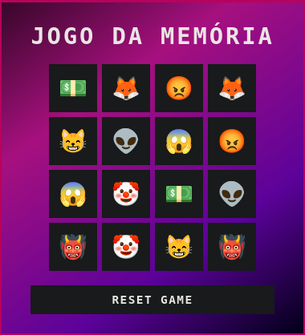

# Jogo da Memória

O Jogo da Memória com Emoji é uma experiência web criada com HTML, CSS e JavaScript. O objetivo do jogo é lembrar onde foi colocada cada carta de um conjunto aleatório de emojis.

## Funcionalidades

- **Clique em Carta**: O jogador pode clicar em qualquer carta para lembrar onde foi colocada.
- **Respostas Corretas/Erradas**: A resposta correta ou errada é exibida na tela após o clique da carta.
- **Reinício do Jogo**: Pressione o botão "RESET GAME" para reiniciar o jogo.

## Desenvolvimento
O site foi desenvolvido usando tecnologias modernas, como:

- **HTML/CSS**: Para estruturar e estilizar a página.
- **JavaScript**: Para implementar a lógica do jogo e interagir com as cartas.
- **Vercel**: Uma plataforma de hospedagem para o site.

## Contribuir para o Projeto

Obrigado por considerar contribuir para Jogo da Memória com Emoji! Para contribuir, siga os seguintes passos:

1.  Crie uma nova branch com '**git checkout -b nome-da-branch**'.
2.  Faça as alterações necessárias.
3.  Confirme as alterações com '**git add**'.
4.  Envia a commit usando '**git commit -m "mensagem-da-commmit**'.
5.  Crie um pull request no GitHub/ GitLab.
